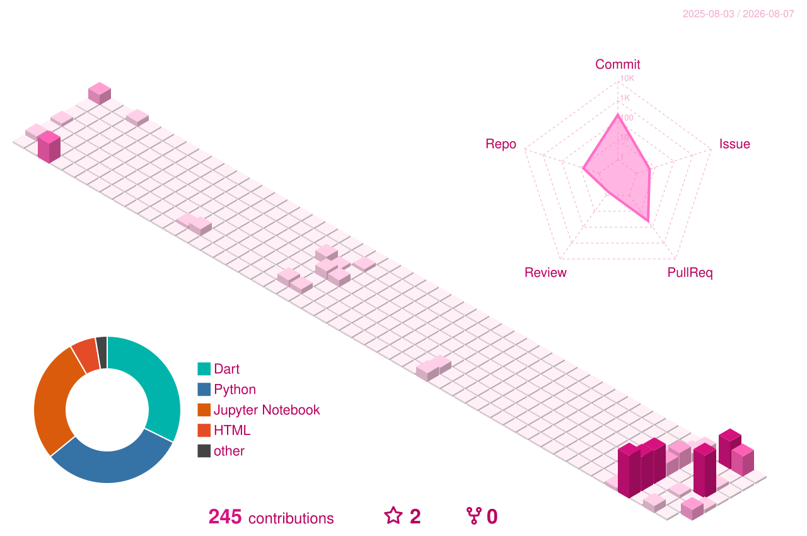

<div align="center">


<a href="https://dangara215-portfolio.vercel.app/"></a>
<a href="https://github.com/DanGaRa215"></a>


<br />

##  About

```text
武蔵野大学 データサイエンス学部 データサイエンス学科 / 28卒
株式会社STREAM  AIデータ戦略開発部門  長期インターン

Motto : 手を動かし、最後まで届ける
```

<br />

##  Skills

### 言語


<br />

### フレームワーク / ライブラリ


<br />

### ツール / 環境


<br />

### 学習中 / 関心領域


<br />

<!-- ===== 一時的に非表示 : ここから =====================================
     画像がまだ存在せず、壊れたアイコンが表示されるため囲っている。
     生成されたらこのコメントの開始行と終了行の2行を消すだけで復活する。

     Contribution : .github/workflows/ の2つが未成功。
                    GitHub Actions の大規模障害 (2026-08-06) で
                    snake=failure / 3D=cancelled。障害復旧後に再実行すれば生成される。
     Stats        : github-readme-stats の公開インスタンスが DEPLOYMENT_PAUSED で
                    全ユーザー 503。復旧待ち、または自前 Vercel へデプロイして URL 差し替え。

##  Contribution




<br />

##  Stats


<br />
     ===== 一時的に非表示 : ここまで ===================================== -->


</div>
