<!-- ヘッダーからバッジまでのヒーロー部分だけを中央揃えにする。
     ここより下は素の左揃えにして、読み物としての一貫性を保つ -->
<div align="center">


<a href="https://dangara215-portfolio.vercel.app/"></a>

<a href="https://github.com/DanGaRa215"></a>


</div>

<br />

##  About

```text
武蔵野大学 データサイエンス学部 データサイエンス学科 / 28卒
株式会社STREAM  AIデータ戦略開発部門  長期インターン

Motto : 手を動かし、最後まで届ける
```

### 日本語

データサイエンスを学んでいる大学2年生です。自然言語処理と推薦システムを中心に、機械学習を「現場で実際に使えるかたち」にすることに関心があります。

株式会社STREAM の AIデータ戦略開発部門で長期インターンをしていて、クライアントの営業支援に向けたデータの収集・整備・活用の仕組みづくりに取り組んでいます。一度きりの分析で終わらせず、継続して価値が出る形にすることを大切にしています。

研究では、レビュー本文の感情分析と星評価を組み合わせた BERT ベースの飲食店推薦システムに取り組み、DEIM2026 で発表しました。ほかにも服装管理アプリ NewMee の技術とビジネスの橋渡し役、Jリーグ順位予測モデル、与信リスク予測コンペ（Aihack 2026）での特徴量エンジニアリングなどを経験しています。

わからない領域でも、まず飛び込んで必要なことをその場で身につけながら進めるタイプです。

### English

I'm a second-year data science student focused on natural language processing and recommender systems, with an interest in turning machine learning into something that actually works in the field.

I work as a long-term intern in the AI & Data Strategy division at STREAM, where I build the pipelines that collect, organise and apply data for client sales support. I care about making analysis that keeps delivering value rather than a one-off report.

My research combines sentiment analysis of review text with star ratings in a BERT-based restaurant recommender, presented at DEIM2026. I've also bridged the technical and business sides of NewMee (a clothing scheduling app), built a J.League standings prediction model, and handled feature engineering for a credit default risk competition (Aihack 2026).

I tend to jump into unfamiliar areas first and pick up what I need along the way.

<br />

##  Skills

### 言語


### フレームワーク / ライブラリ


### ツール / 環境


### 学習中 / 関心領域


<br />

##  Contribution


<br />

##  Stats




<br />


